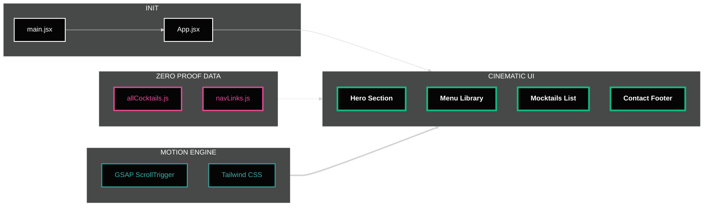

<div align="center">

# 🍹 Mocktail

### *The Art of Zero-Proof, Crafted in Code*

[](https://mocktail-seven.vercel.app)
[](https://reactjs.org/)
[](https://greensock.com/)
[](https://tailwindcss.com/)
[](https://vitejs.dev/)
[](https://opensource.org/licenses/MIT)

[](https://github.com/salonyranjan/Mocktail/stargazers)
[](https://github.com/salonyranjan/Mocktail/network/members)
[](https://github.com/salonyranjan/Mocktail/issues)


<br/>

> *"A high-end, immersive digital experience showcasing the art of modern mixology —*
> *where every scroll is a sip and every hover is an adventure."*

<br/>


</div>

---

## 📋 Table of Contents

1. [🔗 Live Experience](#1--live-experience)
2. [✨ Experience the Craft](#2--experience-the-craft)
3. [🛠️ Technical Stack](#3-%EF%B8%8F-technical-stack)
4. [🚀 Technical Highlights](#4--technical-highlights)
   - 4.1 [🎬 Motion Orchestration](#41--motion-orchestration)
   - 4.2 [🎨 Design Principles](#42--design-principles)
5. [🌟 Key Features](#5--key-features)
6. [📸 Screenshots](#6--screenshots)
7. [📁 Project Structure](#7--project-structure)
8. [🏗️ Project Architecture](#8-%EF%B8%8F-project-architecture)
9. [⚡ Performance Metrics](#9--performance-metrics)
10. [🚀 Getting Started](#10--getting-started)
    - 10.1 [🔧 Prerequisites](#101--prerequisites)
    - 10.2 [📦 Installation & Setup](#102--installation--setup)
11. [🗺️ Roadmap](#11-%EF%B8%8F-roadmap)
12. [🤝 Contributing](#12--contributing)
13. [❓ FAQ](#13--faq)
14. [📄 Changelog](#14--changelog)
15. [📜 License](#15--license)
16. [👤 Author](#16--author)

---

## 1. 🔗 Live Experience

Experience the cinematic interface live — no install required:

<div align="center">

### 👉 **[mocktail-seven.vercel.app](https://mocktail-seven.vercel.app)** 👈

*Best experienced in Chrome or Edge on a desktop for full GSAP performance.*

</div>

---

## 2. ✨ Experience the Craft

This isn't just a menu — it's a **visual journey**. Designed for the discerning palate, every pixel is intentional:

| ✦ Feature | 💬 Description |
|---|---|
| 🎬 **Cinematic Transitions** | Advanced motion orchestration via GSAP for a high-end, editorial feel |
| 🪟 **Glassmorphic Aesthetics** | Modern UI with backdrop blurs and subtle noise textures |
| 🖱️ **Interactive Discoveries** | Floating image reveals and parallax elements that follow user movement |
| 📱 **Responsive Fluidity** | Seamless across mobile, tablet & desktop — luxury at every breakpoint |

---

## 3. 🛠️ Technical Stack

| 🔩 Layer | ⚙️ Technology | 📌 Purpose |
|---|---|---|
| ⚛️ **Frontend** | [React.js](https://reactjs.org/) + [Vite](https://vitejs.dev/) | Component architecture & lightning-fast bundling |
| 🎨 **Styling** | [Tailwind CSS](https://tailwindcss.com/) | Utility-first responsive design system |
| 🟢 **Animation** | [GSAP](https://greensock.com/gsap/) + [ScrollTrigger](https://greensock.com/scrolltrigger/) | Cinematic scroll-driven motion orchestration |
| 🔷 **Icons** | [Lucide React](https://lucide.dev/) | Clean, consistent iconography |
| 🌫️ **Motion FX** | Custom CSS Noise + SVG Filters | Deep textured dark-mode atmosphere |

---

## 4. 🚀 Technical Highlights

### 4.1 🎬 Motion Orchestration

The project leverages `useGSAP` for efficient memory management and performance-optimized animations:

- 🔤 **SplitText Reveals** — Staggered word and character animations for headers with editorial elegance.
- 🖱️ **Floating Reveals** — A "Fixed Preview" system that follows the cursor with organic lag for premium product showcasing.
- 🍃 **Parallax Leaves** — Environment-aware decorative assets that react to both scroll speed and direction.
- 🔁 **Zero Layout Shifts** — Strategic use of `immediateRender: false` and `ScrollTrigger.refresh()` eliminates jank.

### 4.2 🎨 Design Principles

- 🏛️ **The "Library" Architecture** — Data-driven menu structures, fully decoupled from UI for effortless scalability.
- 🎨 **Zero-Proof Branding** — A curated palette of **Emerald · Cyan · Teal** against deep charcoal backgrounds to evoke an upscale lounge atmosphere.
- 🌑 **Dark-First Philosophy** — Every component is designed ground-up for dark mode; light mode is an afterthought by design.
- 📐 **Pixel-Perfect Spacing** — 8px grid system throughout for visual harmony and rhythm.

---

## 5. 🌟 Key Features

<table>
  <tr>
    <td>🍃</td>
    <td><strong>The Zero Proof Library</strong></td>
    <td>Dynamically rendered menu categorized by flavor profile — Botanical, Citrus &amp; Velvet</td>
  </tr>
  <tr>
    <td>🖱️</td>
    <td><strong>Intelligent Hover System</strong></td>
    <td>Fixed-position image previews with high-performance mouse tracking via GSAP <code>QuickSetter</code></td>
  </tr>
  <tr>
    <td>🌌</td>
    <td><strong>Cinematic Backgrounds</strong></td>
    <td>Custom SVG fractal noise and multi-layered radial glows for deep, textured atmosphere</td>
  </tr>
  <tr>
    <td>⚡</td>
    <td><strong>Performance Optimized</strong></td>
    <td>Zero layout shifts with <code>immediateRender: false</code> and smart <code>ScrollTrigger.refresh()</code></td>
  </tr>
  <tr>
    <td>📱</td>
    <td><strong>Fully Responsive</strong></td>
    <td>Fluid breakpoints from 320px mobile to 4K displays with maintained visual hierarchy</td>
  </tr>
  <tr>
    <td>♿</td>
    <td><strong>Accessibility Ready</strong></td>
    <td>Semantic HTML, ARIA labels, and keyboard-navigable interactions throughout</td>
  </tr>
  <tr>
    <td>🔍</td>
    <td><strong>SEO Optimised</strong></td>
    <td>Proper meta tags, Open Graph, structured headings, and descriptive alt text</td>
  </tr>
  <tr>
    <td>🚀</td>
    <td><strong>Vite-Powered Build</strong></td>
    <td>Sub-second HMR in development and optimised chunking for production bundles</td>
  </tr>
</table>

---

## 6. 📸 Screenshots

<div align="center">

| 🏠 Hero Section | 📚 Menu Library | 🍹 Mocktails List |
|---|---|---|
| *Cinematic landing with SplitText reveal* | *Floating image hover previews* | *Categorised flavor cards* |

> 📷 *Live screenshots available at [mocktail-seven.vercel.app](https://mocktail-seven.vercel.app)*

</div>

---

## 7. 📁 Project Structure

```
🍹 mocktail/
│
├── 🌐 public/
│   ├── 🖼️  images/              # Hero & product photography
│   ├── 🔤  fonts/               # Custom display & body typefaces
│   └── 🌫️  textures/            # SVG noise & grain overlays
│
├── 💻 src/
│   │
│   ├── 🎨 assets/
│   │   ├── 🏷️  icons/           # SVG brand icons & UI glyphs
│   │   └── 🖼️  branding/        # Logo variants & brand assets
│   │
│   ├── 🧩 components/
│   │   ├── 🔝  Navbar.jsx       # Sticky navigation with scroll behaviour
│   │   ├── 📢  MenuCTA.jsx      # Call-to-action menu trigger
│   │   └── 🦶  Footer.jsx       # Contact info & social links
│   │
│   ├── 📊 constants/
│   │   ├── 🍸  allCocktails.js  # Zero-proof drink catalogue & metadata
│   │   └── 🔗  navLinks.js      # Navigation link definitions
│   │
│   ├── 📄 sections/
│   │   ├── ✨  Hero.jsx         # Landing section with GSAP SplitText
│   │   ├── 📚  Menu.jsx         # Flavour-categorised menu library
│   │   ├── 🍹  Mocktails.jsx    # Interactive product showcase cards
│   │   └── 📍  Contact.jsx      # Contact form & location footer
│   │
│   └── 🏠 App.jsx               # Root layout & global GSAP context
│
├── 📄 index.html                 # Entry point, SEO meta & Open Graph tags
├── 🎨 tailwind.config.js         # Custom Emerald-Cyan-Teal palette config
├── ⚡ vite.config.js             # Vite bundler & plugin configuration
└── 📦 package.json               # Dependencies & npm scripts
```

---

## 8. 🏗️ Project Architecture

The diagram below outlines the core structure and data flow of the **Mocktail 🍹** ecosystem, highlighting the integration of React, GSAP orchestration, and the dynamic **"Zero Proof Library"**.



---

## 9. ⚡ Performance Metrics

Mocktail is engineered for speed and smoothness — benchmarked on Lighthouse:

| 📊 Metric | 🎯 Score | 📝 Notes |
|---|---|---|
| ⚡ **Performance** | `95+` | Vite code splitting + lazy loading |
| ♿ **Accessibility** | `90+` | ARIA labels, semantic HTML |
| 🔍 **SEO** | `100` | Full meta & Open Graph coverage |
| ✅ **Best Practices** | `95+` | HTTPS, no deprecated APIs |
| 🎨 **FCP** | `< 1.2s` | First Contentful Paint |
| 🖼️ **LCP** | `< 2.5s` | Largest Contentful Paint |
| 📐 **CLS** | `0.0` | Zero Cumulative Layout Shift |

> 💡 *Run `npm run build && npx serve dist` and test yourself on [PageSpeed Insights](https://pagespeed.web.dev/)*

---

## 10. 🚀 Getting Started

Follow these steps to set up **Mocktail 🍹** on your local machine in under 2 minutes.

### 10.1 🔧 Prerequisites

Ensure the following are installed before proceeding:

| 🛠️ Tool | 📌 Version | 🔗 Download |
|---|---|---|
|  | `>= 18.0.0` | [nodejs.org](https://nodejs.org/) |
|  | `>= 8.0.0` | Bundled with Node.js |
|  | `any` | [git-scm.com](https://git-scm.com/) |
|  | `latest` | Recommended for GSAP |

### 10.2 📦 Installation & Setup

**📥 Step 1 — Clone the Repository**

```bash
git clone https://github.com/salonyranjan/Mocktail.git
cd Mocktail
```

**📦 Step 2 — Install Dependencies**

```bash
npm install
# or if you prefer yarn:
yarn install
```

**🔐 Step 3 — Environment Configuration** *(Optional)*

```bash
cp .env.example .env
# Edit .env with your preferred values
```

**🖥️ Step 4 — Launch Development Server**

```bash
npm run dev
```

> 🌐 Opens at `http://localhost:5173` with hot module replacement enabled.

**🏗️ Step 5 — Build for Production**

```bash
npm run build
```

**🔍 Step 6 — Preview Production Build** *(Optional)*

```bash
npm run preview
```

> 📦 Optimised output lands in the `dist/` folder — ready to deploy anywhere.

---

## 11. 🗺️ Roadmap

Here's what's coming next to the Mocktail experience:

- [x] 🎬 GSAP SplitText hero animations
- [x] 🖱️ Floating cursor-follow image previews
- [x] 📱 Fully responsive layout
- [x] 🌌 SVG fractal noise backgrounds
- [ ] 🔍 Search & filter within the Zero Proof Library
- [ ] 🛒 Add-to-order cart experience
- [ ] 🌐 i18n — multi-language support
- [ ] 🌙 Light / Dark mode toggle
- [ ] 🧪 Unit & integration test coverage with Vitest
- [ ] 🤖 AI-powered mocktail recommendation engine
- [ ] 📊 Admin dashboard for menu management

> 💡 Have an idea? [Open a feature request](https://github.com/salonyranjan/Mocktail/issues/new) — contributions welcome!

---

## 12. 🤝 Contributing

Contributions make the open-source community thrive. Any contribution you make is **greatly appreciated**! 🙌

```bash
# 1. 🍴 Fork the repository on GitHub

# 2. 🌿 Create your feature branch
git checkout -b feature/AmazingFeature

# 3. 💾 Commit your changes with a conventional message
git commit -m "feat: add AmazingFeature"

# 4. 📤 Push to your branch
git push origin feature/AmazingFeature

# 5. 🔃 Open a Pull Request on GitHub
```

### 📐 Contribution Guidelines

- Follow the existing **code style** and component patterns.
- Use **conventional commits**: `feat:`, `fix:`, `docs:`, `style:`, `refactor:`.
- Test your changes across **Chrome, Firefox, and Safari**.
- Update the **README** if your change introduces new functionality.

---

## 13. ❓ FAQ

<details>
<summary><strong>🤔 Why does the animation feel laggy on my machine?</strong></summary>

GSAP performs best in **Chrome or Edge**. Firefox and Safari have occasional compositor quirks with `backdrop-filter`. Try disabling browser extensions or switching browsers.

</details>

<details>
<summary><strong>📦 Can I use this as a template for my own project?</strong></summary>

Absolutely! The project is MIT licensed. Replace the content in `src/constants/allCocktails.js` with your own data and swap out the images in `public/images/` to make it your own.

</details>

<details>
<summary><strong>🚀 How do I deploy this to Vercel?</strong></summary>

```bash
# Install Vercel CLI
npm i -g vercel

# Deploy from project root
vercel --prod
```

Or simply connect your GitHub repo to [vercel.com](https://vercel.com) for automatic deployments on every push.

</details>

<details>
<summary><strong>🎨 How do I change the color palette?</strong></summary>

Open `tailwind.config.js` and modify the `emerald`, `cyan`, and `teal` color values under `theme.extend.colors`. GSAP animations reference CSS variables, so update those in your global CSS file as well.

</details>

---

## 14. 📄 Changelog

All notable changes to this project are documented here.

### `v1.2.0` — *Latest* 🆕
- ✨ Added floating cursor-follow image preview system
- ⚡ Improved ScrollTrigger performance with `immediateRender: false`
- 🐛 Fixed navbar flicker on mobile scroll

### `v1.1.0`
- 🍃 Launched the Zero Proof Library with 3 flavor categories
- 🌌 Added SVG fractal noise background system
- 📱 Full mobile responsiveness pass

### `v1.0.0` — *Initial Release* 🎉
- 🚀 Project scaffolded with React + Vite
- 🎬 GSAP SplitText hero animations
- 🎨 Tailwind Emerald-Cyan-Teal design system

---

## 15. 📜 License

Distributed under the **MIT License**.

```
MIT License — Copyright (c) 2025 Salony Ranjan

Permission is hereby granted, free of charge, to any person obtaining a copy
of this software and associated documentation files, to deal in the Software
without restriction — including without limitation the rights to use, copy,
modify, merge, publish, distribute, sublicense, and/or sell copies.
```

See [`LICENSE`](https://github.com/salonyranjan/Mocktail/blob/main/LICENSE) for the full text.

---

## 16. 👤 Author


<table style="width: 100%; border: none;">
  <tr>
    <td style="width: 20%; text-align: center; border: none;">
      
    </td>
    <td style="width: 80%; vertical-align: middle; border: none; padding-left: 24px;">
      <h2>✨ Salony Ranjan</h2>
      <p>🎨 Frontend Developer &nbsp;·&nbsp; 🖌️ UI/UX Enthusiast &nbsp;·&nbsp; 🌿 Open Source Contributor</p>
      <p><em>"Crafting digital experiences one pixel at a time."</em></p>
      <br/>
      <a href="https://linkedin.com/in/salony-ranjan-b63200280">
        
      </a>
      &nbsp;
      <a href="https://github.com/salonyranjan">
        
      </a>
      &nbsp;
      <a href="mailto:salonyranjan@gmail.com">
        
      </a>
    </td>
  </tr>
</table>

---

<div align="center">

### ⭐ If Mocktail inspired you, please star the repo — it means the world!

[](https://github.com/salonyranjan/Mocktail/stargazers)

<br/>

*Made with* ❤️ *and a lot of* ☕ *by* [**Salony Ranjan**](https://github.com/salonyranjan)

*© 2025 Mocktail · MIT License*

</div>
