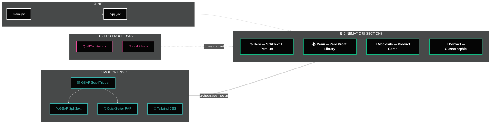

<div align="center">

<!-- ══════════════════════════════════════════════════════════════ -->
<!--                        HERO BANNER                           -->
<!-- ══════════════════════════════════════════════════════════════ -->


<br/>

<!-- ── Hero Image ── -->
<a href="https://mocktail-seven.vercel.app">
  
</a>

<br/><br/>


<br/><br/>

<!-- ── Live Demo Badge ── -->
<a href="https://mocktail-seven.vercel.app">
  
</a>

<br/><br/>

<!-- ── Tech Badges ── -->


<br/>

<!-- ── Status Badges ── -->


<br/><br/>

> *"A high-end, immersive digital experience showcasing the art of modern zero-proof mixology —*
> *where every scroll is a sip and every hover is an adventure."*

<br/>

<a href="https://mocktail-seven.vercel.app"></a>
&nbsp;
<a href="#9--getting-started"></a>
&nbsp;
<a href="#4--technical-highlights"></a>
&nbsp;
<a href="#11--roadmap"></a>

</div>

---

## 📋 Table of Contents

1. [🍹 What is Mocktail?](#1--what-is-mocktail)
2. [🖼️ UI Showcase](#2-%EF%B8%8F-ui-showcase)
   - 2.1 [🏠 Immersive Hero Scene](#21--immersive-hero-scene)
   - 2.2 [📚 Zero Proof Library — The Menu](#22--zero-proof-library--the-menu)
   - 2.3 [🍹 Mocktails Showcase — Interactive Product Cards](#23--mocktails-showcase--interactive-product-cards)
   - 2.4 [🖱️ Intelligent Hover System — Cursor-Follow Reveal](#24-%EF%B8%8F-intelligent-hover-system--cursor-follow-reveal)
   - 2.5 [✨ Featured Mocktails — Close-Up Detail](#25--featured-mocktails--close-up-detail)
   - 2.6 [📍 Cinematic Contact — Glassmorphic Close](#26--cinematic-contact--glassmorphic-close)
   - 2.7 [📊 Feature × Device Matrix](#27--feature--device-matrix)
3. [✨ Experience the Craft](#3--experience-the-craft)
4. [🚀 Technical Highlights](#4--technical-highlights)
   - 4.1 [🎬 Motion Orchestration](#41--motion-orchestration)
   - 4.2 [🎨 Design Principles](#42--design-principles)
5. [🌟 Key Features](#5--key-features)
6. [🛠️ Technical Stack](#6-%EF%B8%8F-technical-stack)
   - 6.1 [⚛️ Frontend & Build](#61-%EF%B8%8F-frontend--build)
   - 6.2 [🎬 Animation & Motion](#62--animation--motion)
   - 6.3 [☁️ Deployment](#63-%EF%B8%8F-deployment)
7. [📁 Project Structure](#7--project-structure)
8. [🏗️ Architecture Diagram](#8-%EF%B8%8F-architecture-diagram)
9. [📦 Getting Started](#9--getting-started)
   - 9.1 [🔧 Prerequisites](#91--prerequisites)
   - 9.2 [⬇️ Installation & Setup](#92-%EF%B8%8F-installation--setup)
10. [⚡ Performance Metrics](#10--performance-metrics)
11. [🗺️ Roadmap](#11-%EF%B8%8F-roadmap)
12. [🤝 Contributing](#12--contributing)
13. [❓ FAQ](#13--faq)
14. [📄 Changelog](#14--changelog)
15. [👤 Author](#15--author)
16. [⭐ Show Your Support](#16--show-your-support)

---

## 1. 🍹 What is Mocktail?

**Mocktail** is a high-end, immersive digital experience showcasing the art of modern zero-proof mixology. It's not just a menu — it's a **cinematic visual journey** built for the discerning palate. Every animation, texture, and interaction has been intentionally crafted to evoke the atmosphere of a premium lounge, all running at a silky 60 FPS in the browser.

> 🎯 **Built to showcase:** Advanced GSAP scroll orchestration, React architecture, and the intersection of editorial motion design with functional web engineering.

| 🔖 | Version | 📦 Highlight |
|:---:|:---:|:---|
| 🆕 | `v1.2` | Cursor-follow floating reveals · ScrollTrigger performance pass · Mobile navbar fix |
| 🔄 | `v1.1` | Zero Proof Library with 3 flavor categories · SVG fractal noise backgrounds |
| 🎉 | `v1.0` | GSAP SplitText hero · Emerald-Cyan-Teal design system · Vite scaffold |

---

## 2. 🖼️ UI Showcase

<div align="center">


</div>

---

### 2.1 🏠 Immersive Hero Scene


> ✨ **GSAP SplitText** staggered character reveal — each letter enters in editorial waves · 🍃 **Parallax leaves** drift dynamically with scroll velocity · 🌌 **SVG fractal noise** breathes textured depth into the dark atmospheric background

---

### 2.2 📚 Zero Proof Library — *The Menu*


<br/>

> 🌿 **Botanical** — earthy, herb-forward zero-proof drinks crafted for the green palate

<br/>


<br/>

> 🍋 **Citrus** — bright, tart, and sun-kissed blends bursting with freshness and zing

<br/>


<br/>

> 🍫 **Velvet** — rich, smooth, dessert-inspired mocktails for the indulgent late-night hour

<br/>

> 🍸 **Botanical · Citrus · Velvet** — three flavor categories dynamically rendered from `allCocktails.js` · Switching categories triggers smooth GSAP cross-fades between the full card sets with zero page reloads

---

### 2.3 🍹 Mocktails Showcase — *Interactive Product Cards*


<br/>

> ⚡ **GSAP-staggered scroll reveal** — cards enter from below with offset timing for a layered, cinematic feel

<br/>


<br/>

> 📋 Each card surfaces: **image · name · flavour profile tags · tasting notes** — all fully data-driven from `allCocktails.js`

---

### 2.4 🖱️ Intelligent Hover System — *Cursor-Follow Reveal*


<br/>

> 🖱️ **Active state** — image preview materialises and follows the cursor with organic, physical inertia via GSAP `QuickSetter` at 60fps

<br/>


<br/>

> 💨 **Idle state** — preview gracefully fades and resets to its origin with eased spring physics — zero snapping, all feel

<br/>

> 🎯 **GSAP `QuickSetter`** drives X/Y position in a RAF loop — the preview follows the cursor like a physical object with mass. Organic lag is tuned via a lerp factor for that signature premium feel that tooltips can never achieve

---

### 2.5 ✨ Featured Mocktails — *Close-Up Detail*


<br/>

> 🎬 **GSAP-orchestrated timelines** reveal product identity and tasting notes on scroll entry — nothing loads all at once

<br/>


<br/>

> 🌟 **Multi-layered radial CSS glows** amplify the neon cocktail photography into a luminous, living scene

<br/>


<br/>

> 🌌 **Custom SVG fractal noise** adds cinematic grain and dimensional depth to every scroll-bound section — nothing is flat, everything breathes

---

### 2.6 📍 Cinematic Contact — *Glassmorphic Close*


<br/>

> 🪟 **Glassmorphism** via `backdrop-blur` + semi-transparent layering creates material depth without visual clutter · 📍 Location strip anchors the brand in physical space · Social links bloom with neon glow on hover — a satisfying, immersive close to the journey

---

### 2.7 📊 Feature × Device Matrix

<div align="center">

| 🖥️ Feature | 📱 Mobile | 💻 Tablet | 🖥️ Desktop |
|:---|:---:|:---:|:---:|
| 🎬 SplitText Hero Reveal | ✅ Full | ✅ Full | ✅ Full |
| 🖱️ Cursor-Follow Preview | ❌ Touch only | 🔄 Partial | ✅ Full |
| 🍃 Parallax Leaves | ✅ Full | ✅ Full | ✅ Full |
| 🌌 Fractal Noise BG | ✅ Full | ✅ Full | ✅ Full |
| 📚 Zero Proof Library | ✅ Full | ✅ Full | ✅ Full |
| 🃏 Hover Card Reveals | ❌ | 🔄 Partial | ✅ Full |
| 📍 Contact Form | ✅ Full | ✅ Full | ✅ Full |

</div>

> 📡 *Experience every interaction live at **[mocktail-seven.vercel.app](https://mocktail-seven.vercel.app)***

---

## 3. ✨ Experience the Craft

Every pixel is intentional. Designed for the discerning palate — this is what separates Mocktail from any ordinary product page:

| ✦ Craft Element | 💬 What It Delivers |
|:---|:---|
| 🎬 **Cinematic Transitions** | Advanced GSAP motion orchestration for a high-end, editorial magazine feel on every scroll |
| 🪟 **Glassmorphic Aesthetics** | `backdrop-blur` panels with subtle SVG grain noise textures layered underneath for material depth |
| 🖱️ **Interactive Discoveries** | Floating image reveals that follow the cursor with organic, spring-like inertia — not a tooltip |
| 📱 **Responsive Fluidity** | The luxury experience is maintained from 320px mobile to 4K ultra-wide — no breakpoint left behind |
| 🌑 **Dark-First Philosophy** | Every component is designed ground-up for dark mode — not retrofitted with `dark:` variant overrides |
| 📐 **8px Grid System** | Pixel-perfect spatial rhythm throughout every section, card, and component |
| 🎨 **Zero-Proof Branding** | Emerald · Cyan · Teal against deep charcoal — a palette that evokes an upscale lounge at midnight |
| ♿ **Accessibility First** | Semantic HTML5 landmarks, ARIA labels on all interactive elements, full keyboard navigation |

---

## 4. 🚀 Technical Highlights

### 4.1 🎬 Motion Orchestration

The project leverages `useGSAP` for scoped, memory-managed animation contexts that clean up automatically on component unmount — no stale tweens, no memory leaks:

```
GSAP Motion Stack
│
├── 🔤 SplitText Reveals
│     └── Headers split to word + char level
│         Each character revealed in staggered editorial waves
│
├── 🖱️ QuickSetter Cursor Tracking
│     └── 60fps cursor-follow image preview system
│         Organic lag via RAF lerp — feels physical, not snapped
│
├── 🍃 Parallax Leaves
│     └── Scroll-speed + direction reactive environmental assets
│         Add cinematic depth without distracting from content
│
├── 🔁 ScrollTrigger Refresh Strategy
│     └── immediateRender: false eliminates layout shift on load
│         ScrollTrigger.refresh() called post-font + image load
│
└── 🎬 Scoped Timeline Contexts
      └── Section-scoped useGSAP() contexts
          Automatic cleanup prevents tween accumulation
```

- **SplitText Reveals** — Headers split to word and character level, each revealed in staggered timing waves for editorial drama. No two sections animate identically.
- **Floating Reveals** — `QuickSetter` drives a fixed preview element following the cursor with organic lag — the premium product hover effect in the menu section.
- **Parallax Leaves** — Environment-aware decorative assets that sense scroll speed and direction via ScrollTrigger, adding cinematic environmental depth.
- **Zero Layout Shifts** — Strategic `immediateRender: false` combined with a `ScrollTrigger.refresh()` call after all assets load eliminates every form of scroll jank and CLS.

### 4.2 🎨 Design Principles

- 🏛️ **"Library" Architecture** — Menu data is fully decoupled from the UI in `constants/allCocktails.js`. Add a new drink, and every section that renders it updates automatically.
- 🎨 **Zero-Proof Branding** — **Emerald · Cyan · Teal** against deep charcoal — a palette that evokes a premium lounge at midnight. Every colour choice reinforces the brand promise.
- 🌑 **Dark-First** — No `dark:` variant overrides anywhere. Dark mode is the base, not a skin. Every shadow, glow, and blur is designed exclusively for the dark canvas.
- 📐 **8px Grid** — Every margin, padding, and gap follows an 8px spatial rhythm for visual harmony and effortless scalability.

---

## 5. 🌟 Key Features

<table>
  <tr><td>🍃</td><td><strong>Zero Proof Library</strong></td><td>Dynamically rendered menu categorised by flavour profile — Botanical, Citrus &amp; Velvet — powered by a clean data-first constants layer. Add a drink in the data file; it appears everywhere automatically.</td></tr>
  <tr><td>🖱️</td><td><strong>Intelligent Hover System</strong></td><td>Fixed-position image previews with high-performance cursor tracking via GSAP <code>QuickSetter</code>. Lerp-smoothed in a RAF loop for buttery 60fps organic movement — no jitter, no snap.</td></tr>
  <tr><td>🌌</td><td><strong>Cinematic Backgrounds</strong></td><td>Custom SVG fractal noise filters layered with multi-tier radial CSS glows create a deep, textured dark-mode atmosphere that breathes as you scroll.</td></tr>
  <tr><td>🎬</td><td><strong>SplitText Hero</strong></td><td>GSAP SplitText splits every major heading to character level — each character is revealed in staggered timing waves for maximum editorial drama on first load.</td></tr>
  <tr><td>🍃</td><td><strong>Parallax Leaves</strong></td><td>Scroll-speed and direction-aware decorative assets that add cinematic environmental depth throughout the page without overwhelming content hierarchy.</td></tr>
  <tr><td>⚡</td><td><strong>Zero Layout Shifts</strong></td><td>Strategic <code>immediateRender: false</code> + timed <code>ScrollTrigger.refresh()</code> eliminates all scroll jank and CLS. Every animation fires at the exact right moment.</td></tr>
  <tr><td>📱</td><td><strong>Fully Responsive</strong></td><td>Fluid CSS breakpoints from 320px iPhone SE to 4K ultra-wide — visual hierarchy, typography scale, and the luxury brand feel are preserved at every viewport size.</td></tr>
  <tr><td>♿</td><td><strong>Accessibility Ready</strong></td><td>Semantic HTML5 landmarks, ARIA labels on all interactive elements, and full keyboard navigation throughout — beauty and inclusivity are not mutually exclusive.</td></tr>
  <tr><td>🔍</td><td><strong>SEO Optimised</strong></td><td>Proper meta tags, Open Graph data, a structured heading hierarchy, and descriptive alt text on every image — discoverable from day one.</td></tr>
  <tr><td>🚀</td><td><strong>Vite-Powered Build</strong></td><td>Sub-second HMR in development, optimised tree-shaken and code-split production bundles landing in <code>dist/</code> in under 5 seconds.</td></tr>
</table>

---

## 6. 🛠️ Technical Stack

### 6.1 ⚛️ Frontend & Build

<p>
  
  
  
  
</p>

### 6.2 🎬 Animation & Motion

<p>
  
  
  
  
</p>

### 6.3 ☁️ Deployment

<p>
  
  
  
</p>

| 🔩 Layer | ⚙️ Technology | 📌 Purpose |
|:---|:---|:---|
| ⚛️ **Frontend** | React.js + Vite | Component architecture & lightning-fast HMR |
| 🎨 **Styling** | Tailwind CSS | Utility-first design system + custom Emerald-Cyan-Teal colour tokens |
| 🟢 **Animation** | GSAP + ScrollTrigger | Cinematic scroll-driven motion orchestration |
| 🔤 **Text FX** | GSAP SplitText | Character + word-level staggered reveal animations |
| 🖱️ **Interaction** | GSAP QuickSetter | High-performance 60fps cursor position tracking |
| 🌫️ **Atmosphere** | Custom SVG Noise + CSS Glows | Textured dark-mode depth and cinematic ambience |
| 🔷 **Icons** | Lucide React | Clean, consistent, and lightweight SVG iconography |
| 🚀 **Deploy** | Vercel | Global edge CDN, automatic deploy on every `git push` to `main` |

---

## 7. 📁 Project Structure

```
🍹 mocktail/
│
├── 🌐 public/
│   ├── 🖼️  images/                  # Hero & product photography
│   ├── 🔤  fonts/                   # Custom display & body typefaces
│   └── 🌫️  textures/                # SVG noise & grain overlays
│
├── 💻 src/
│   │
│   ├── 🎨 assets/
│   │   ├── 🏷️  icons/               # SVG brand icons & UI glyphs
│   │   └── 🖼️  branding/            # Logo variants & brand assets
│   │
│   ├── 🧩 components/
│   │   ├── 🔝  Navbar.jsx           # Sticky nav with scroll-aware behaviour
│   │   ├── 📢  MenuCTA.jsx          # Call-to-action menu trigger button
│   │   └── 🦶  Footer.jsx           # Contact info & social links strip
│   │
│   ├── 📊 constants/
│   │   ├── 🍸  allCocktails.js      # Zero-proof drink catalogue & metadata
│   │   └── 🔗  navLinks.js          # Navigation link definitions
│   │
│   ├── 📄 sections/
│   │   ├── ✨  Hero.jsx             # Landing — GSAP SplitText + parallax leaves
│   │   ├── 📚  Menu.jsx             # Flavour-categorised Zero Proof Library
│   │   ├── 🍹  Mocktails.jsx        # Interactive product showcase cards
│   │   └── 📍  Contact.jsx          # Glassmorphic contact form + footer
│   │
│   └── 🏠 App.jsx                   # Root layout & global GSAP context
│
├── 📄 index.html                     # Entry point, SEO meta & Open Graph tags
├── 🎨 tailwind.config.js             # Emerald-Cyan-Teal custom colour palette
├── ⚡ vite.config.js                 # Vite bundler & plugin configuration
└── 📦 package.json                   # Dependencies & npm scripts
```

---

## 8. 🏗️ Architecture Diagram



**How it all fits together:**

| 🔷 Layer | 📝 Role |
|:---|:---|
| 🚀 **Init** | `main.jsx` mounts React; `App.jsx` owns the global GSAP context and section render order |
| 📊 **Data** | `allCocktails.js` drives the entire menu — swap data and the UI updates everywhere automatically |
| ⚡ **Motion Engine** | GSAP + ScrollTrigger orchestrates all animations; Tailwind CSS handles all static styling |
| 🎬 **Cinematic UI** | Four section components consume data + GSAP to render the full editorial experience |

---

## 9. 📦 Getting Started

Get Mocktail running locally in under **2 minutes**.

### 9.1 🔧 Prerequisites

| 🛠️ Tool | 📌 Version | 🔗 Download |
|:---|:---:|:---|
|  | `≥ 18.0.0` | [nodejs.org](https://nodejs.org/) |
|  | `≥ 8.0.0` | Bundled with Node.js |
|  | any | [git-scm.com](https://git-scm.com/) |
|  | latest | Best GSAP compositor performance |

### 9.2 ⬇️ Installation & Setup

**📥 Step 1 — Clone the repository**

```bash
git clone https://github.com/salonyranjan/Mocktail.git
cd Mocktail
```

**📦 Step 2 — Install dependencies**

```bash
npm install
# or with yarn:
yarn install
```

**🔐 Step 3 — Environment** *(Optional)*

```bash
cp .env.example .env
# Edit .env with your preferred values
```

**🖥️ Step 4 — Start the dev server**

```bash
npm run dev
# → http://localhost:5173  (hot reload enabled)
```

**🏗️ Step 5 — Production build**

```bash
npm run build
```

**🔍 Step 6 — Preview the production build** *(Optional)*

```bash
npm run preview
# Test the production bundle locally before deploying
```

| 📜 Script | 💻 Command | 📝 Purpose |
|:---|:---|:---|
| 🚀 **Dev** | `npm run dev` | Vite HMR server at `http://localhost:5173` |
| 🏗️ **Build** | `npm run build` | Optimised, tree-shaken `dist/` output |
| 🔍 **Preview** | `npm run preview` | Serve and test the production build locally |
| 🧹 **Lint** | `npm run lint` | ESLint code quality and style check |

---

## 10. ⚡ Performance Metrics

Benchmarked on Lighthouse — Mocktail is engineered for both visual richness and speed simultaneously:

| 📊 Metric | 🎯 Score | 📝 Implementation Detail |
|:---|:---:|:---|
| ⚡ **Performance** | `95+` | Vite code-splitting + lazy asset loading per route |
| ♿ **Accessibility** | `90+` | ARIA labels, semantic HTML5, full keyboard navigation |
| 🔍 **SEO** | `100` | Full meta tags, Open Graph, structured heading hierarchy |
| ✅ **Best Practices** | `95+` | HTTPS, no deprecated APIs, correct image aspect ratios |
| 🎨 **FCP** | `< 1.2s` | First Contentful Paint |
| 🖼️ **LCP** | `< 2.5s` | Largest Contentful Paint |
| 📐 **CLS** | `0.00` | Zero Cumulative Layout Shift via `immediateRender: false` |
| 🎬 **Animation FPS** | `60fps` | GSAP hardware-accelerated CSS compositor |

> 💡 Verify yourself: run `npm run build && npx serve dist`, then test at [PageSpeed Insights](https://pagespeed.web.dev/)

---

## 11. 🗺️ Roadmap

| Status | 🚀 Feature | 🎯 Priority |
|:---:|:---|:---:|
| ✅ | GSAP SplitText hero animations | 🔴 Core |
| ✅ | Floating cursor-follow image previews | 🔴 Core |
| ✅ | SVG fractal noise atmospheric backgrounds | 🔴 Core |
| ✅ | Fully responsive layout — 320px to 4K | 🔴 Core |
| ✅ | Zero Proof Library — Botanical · Citrus · Velvet | 🔴 Core |
| ✅ | Parallax leaf decorations with scroll physics | 🔴 Core |
| 🔄 | **Search & filter** within the Zero Proof Library | 🟡 High |
| 🔄 | **Add-to-order cart** experience with animated drawer | 🟡 High |
| 🔄 | **Light / Dark mode toggle** with smooth transition | 🟡 High |
| 📅 | **i18n** — multi-language support with `react-i18next` | 🟢 Planned |
| 📅 | **Vitest** — unit & integration component coverage | 🟢 Planned |
| 📅 | **Admin dashboard** for menu management | 🟢 Planned |
| 💡 | **AI-powered** mocktail recommendation engine | 🔵 Idea |
| 💡 | **Cocktail builder** — mix-your-own interactive tool | 🔵 Idea |

> 💡 Have an idea? [Open a feature request →](https://github.com/salonyranjan/Mocktail/issues/new)

---

## 12. 🤝 Contributing

Contributions make the open-source community thrive — any contribution you make is **greatly appreciated**! 🍃

```bash
# 1. Fork the repository on GitHub

# 2. Create your feature branch
git checkout -b feature/AmazingFeature

# 3. Commit using conventional format
git commit -m "feat: add AmazingFeature"
# Prefixes: fix: | docs: | style: | refactor: | test: | chore:

# 4. Push and open a Pull Request
git push origin feature/AmazingFeature
```

**Contribution guidelines:**

- Follow the existing code style and GSAP animation patterns found in each section component
- Test across **Chrome, Firefox, and Safari** — GSAP `backdrop-filter` behaviour can differ between engines
- Update the README if your change introduces new UI, functionality, or animation technique
- Profile with Chrome DevTools Performance panel before submitting — keep animation cost under 4ms per frame

**Priority areas for contributions:**

| 🔥 Area | 📝 What's Needed |
|:---|:---|
| 🌐 i18n | Multi-language support with `react-i18next` |
| 🛒 Cart | Animated order drawer with item management state |
| 🧪 Tests | Vitest + React Testing Library component coverage |
| 🎨 Themes | Light mode implementation using CSS custom properties |

---

## 13. ❓ FAQ

<details>
<summary><strong>🤔 Why does the animation feel laggy on my machine?</strong></summary>

GSAP performs best in **Chrome or Edge** — they have the most optimised compositor for `backdrop-filter` and stacked CSS transform pipelines. Firefox and Safari have occasional quirks with these effects. Try disabling browser extensions first (they can interrupt the RAF loop), or switch to Chrome for the full cinematic 60fps experience.
</details>

<details>
<summary><strong>📦 Can I use this as a template for my own project?</strong></summary>

Absolutely — it's MIT licensed. Replace `src/constants/allCocktails.js` with your own product data, swap images in `public/images/`, and update the colour tokens in `tailwind.config.js`. Because of the data-driven architecture, your content changes cascade through the entire UI automatically — the components don't care what the data contains.
</details>

<details>
<summary><strong>🚀 How do I deploy to Vercel?</strong></summary>

```bash
# Option A — Vercel CLI (fastest)
npm i -g vercel
vercel --prod
```

Or connect your GitHub repo at [vercel.com/new](https://vercel.com/new) — Vercel auto-detects Vite, sets the correct build command (`npm run build`) and output directory (`dist`), and deploys automatically on every `git push` to `main`.
</details>

<details>
<summary><strong>🎨 How do I change the colour palette?</strong></summary>

Open `tailwind.config.js` and update the `emerald`, `cyan`, and `teal` values under `theme.extend.colors`. Then update the matching CSS custom properties in `src/index.css` — GSAP animation targets reference those variables for glow colours, so both need to stay in sync for the full atmospheric effect.
</details>

<details>
<summary><strong>🖱️ Why doesn't the cursor-follow preview work on mobile?</strong></summary>

The floating preview uses `mousemove` pointer events and GSAP `QuickSetter` — it requires a hardware cursor with continuous position tracking. On touch devices, pointer events fire only on tap and don't track ongoing position. On mobile, the library falls back to standard optimised card interactions instead.
</details>

<details>
<summary><strong>🌿 How do I add a new mocktail to the library?</strong></summary>

Open `src/constants/allCocktails.js` and add a new object to the appropriate category array (`botanical`, `citrus`, or `velvet`). Include `name`, `description`, `tags`, and `image` fields. Save — because the UI is fully data-driven, the new card appears in the Zero Proof Library, the product showcase, and any featured sections automatically.
</details>

---

## 14. 📄 Changelog

| Version | Date | Highlights |
|:---|:---:|:---|
| 🆕 `v1.2.0` | 2026 | Cursor-follow floating image preview · `immediateRender` ScrollTrigger pass · mobile navbar flicker fix |
| `v1.1.0` | 2026 | Zero Proof Library — Botanical · Citrus · Velvet · SVG fractal noise backgrounds · full mobile responsiveness |
| `v1.0.0` | 2026 | 🎉 Initial release — React + Vite scaffold · GSAP SplitText hero · Emerald-Cyan-Teal design system |

---

## 15. 👤 Author

<table style="border:none;">
  <tr>
    <td align="center" style="border:none;" width="170">
      
    </td>
    <td style="border:none; padding-left:24px;">
      <h3>✨ Salony Ranjan</h3>
      <p>🎨 Frontend Developer &nbsp;·&nbsp; 🖌️ Motion Design Engineer &nbsp;·&nbsp; 🌿 Open Source Contributor</p>
      <p><em>"Crafting digital experiences one pixel — and one keyframe — at a time."</em></p>
      <br/>
      <a href="https://linkedin.com/in/salony-ranjan-b63200280"></a>
      &nbsp;
      <a href="https://github.com/salonyranjan"></a>
      &nbsp;
      <a href="mailto:salonyranjan@gmail.com"></a>
      &nbsp;
      <a href="https://vertex-flow-phi.vercel.app/"></a>
    </td>
  </tr>
</table>

---

## 16. ⭐ Show Your Support

<div align="center">

If Mocktail gave you inspiration, taught you a GSAP trick, or just looked stunning in your browser — show it some love! 🍹

> 💡 **Pro Tip:** Go to GitHub repo **Settings → Social Preview** and upload the hero screenshot from `public/images/preview.png`. When you share on LinkedIn, your cinematic dark-mode UI renders as the card preview — not a generic GitHub logo. One image, massive impact.

<a href="https://github.com/salonyranjan/Mocktail/stargazers"></a>
&nbsp;
<a href="https://github.com/salonyranjan/Mocktail/network/members"></a>
&nbsp;
<a href="https://mocktail-seven.vercel.app"></a>
&nbsp;
<a href="https://github.com/salonyranjan/Mocktail/issues/new"></a>

<br/><br/>


<br/>

*Made with* ❤️ *and a lot of* ☕ *by* [**Salony Ranjan**](https://github.com/salonyranjan) &nbsp;·&nbsp; *© 2026 Mocktail · MIT*


</div>
