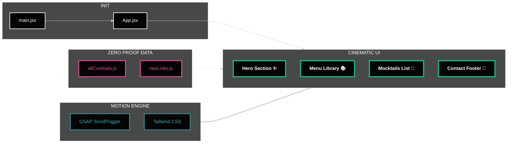

# Mocktail 🍹 

[](https://mocktail-seven.vercel.app)
[](https://reactjs.org/)
[](https://greensock.com/)
[](https://tailwindcss.com/)
[](https://vitejs.dev/)
[](https://opensource.org/licenses/MIT)

A high-end, immersive digital experience showcasing the art of modern mixology...

 

---

## 🔗 Live Experience

Experience the cinematic interface live at:  👉 **[mocktail-seven.vercel.app](https://mocktail-seven.vercel.app)**

---

## ✨ Experience the Craft
This isn't just a menu; it's a visual journey. Designed for the discerning palate, the platform features:
- **Cinematic Transitions:** Advanced motion orchestration using GSAP for a high-end, editorial feel.
- **Glassmorphic Aesthetics:** Modern UI components with backdrop blurs and subtle noise textures.
- **Interactive Discoveries:** Floating image reveals and parallax elements that respond to user movement.
- **Responsive Fluidity:** A seamless experience across mobile, tablet, and desktop, maintaining visual weight and luxury branding.
  
---

## 🛠️ Technical Stack

- **Frontend:** [React.js](https://reactjs.org/) + [Vite](https://vitejs.dev/)
- **Styling:** [Tailwind CSS](https://tailwindcss.com/)
- **Animation:** [GSAP](https://greensock.com/gsap/) (GreenSock Animation Platform) + [ScrollTrigger](https://greensock.com/scrolltrigger/)
- **Components:** [Lucide React](https://lucide.dev/) for iconography
- **Motion:** Custom CSS Noise texturing and SVG filters

---
## 🚀 Technical Highlights

### Motion Orchestration
The project utilizes `useGSAP` for efficient memory management and performance-optimized animations. Key features include:
- **SplitText Reveals:** Staggered word and character animations for headers.
- **Floating Reveals:** A "Fixed Preview" logic that follows the cursor with organic lag for premium product showcasing.
- **Parallax Leaves:** Environment-aware assets that react to scroll speed and direction.

### Design Principles
- **The "Library" Architecture:** Data-driven menu structures allowing for easy scalability.
- **Zero-Proof Branding:** A curated color palette of **Emerald, Cyan, and Teal** set against deep charcoal backgrounds to evoke a high-end lounge atmosphere.

---

## 🌟 Key Features

* **The Zero Proof Library:** A dynamically rendered menu system categorized by flavor profile (Botanical, Citrus, Velvet).
* **Intelligent Hover System:** Fixed-position image previews with high-performance mouse tracking via GSAP QuickSetter.
* **Cinematic Backgrounds:** Custom SVG fractal noise and multi-layered radial glows for a deep, textured dark-mode experience.
* **Performance Optimized:** Zero layout shifts during animation through strategic use of `immediateRender: false` and `ScrollTrigger.refresh()`.
  
---
## 📁 Project Structure

```text
mocktail/
├── public/              # Static assets (images, fonts, noise textures)
├── src/
│   ├── assets/          # Project-specific icons and branding
│   ├── components/      # Reusable UI (Navbar, MenuCTA, Footer)
│   ├── constants/       # Centralized menu data (allCocktails, navLinks)
│   ├── sections/        # Main page sections (Hero, Mocktails, Contact)
│   └── App.jsx          # Root layout and GSAP orchestration
├── index.html           # Meta tags and SEO configuration
└── tailwind.config.js   # Custom Emerald-Cyan color palette
```
---
## 📁 Project Architecture 🏗️

The diagram below outlines the core structure and data flow of the **Mocktail 🍹** ecosystem, highlighting the integration of React, GSAP orchestration, and the dynamic **"Zero Proof Library"** (Menu data).


---

## 📦 Getting Started

Follow these steps to set up the **Mocktail 🍹** environment on your local machine.

### Prerequisites

Before you begin, ensure you have the following installed:
* [Node.js](https://nodejs.org/) (Version 18.0 or higher recommended)
* [npm](https://www.npmjs.com/) or [yarn](https://yarnpkg.com/)
* A modern web browser (Chrome or Edge recommended for GSAP performance)

### Installation & Setup

1. **Clone the Repository**
 ```bash
 git clone [https://github.com/salonyranjan/Mocktail.git](https://github.com/salonyranjan/Mocktail.git)
  cd Mocktail
  ```
2. **Install Dependencies**
Install the necessary React, GSAP, and Tailwind libraries:
 ```bash
npm install
 ```
3. **Environment Configuration**
(Optional) If you decide to add a backend or AI features later:
```bash
cp .env.example .env
```
4. **Launch Development Server**
Start the local server to view the cinematic transitions in real-time:
```bash
npm run dev
```
5. **Build for Production**
To generate a high-performance, minified build:
```bash
npm run build
```
---

## 👤 Author


<table style="width: 100%; border: none;">
  <tr>
    <td style="width: 25%; text-align: center; border: none;">
      
    </td>
    <td style="width: 75%; vertical-align: middle; border: none; padding-left: 20px;">
      <h1><strong>Salony Ranjan</strong></h1>
      <div>
        <a href="linkedin.com/in/salony-ranjan-b63200280"></a>
        <a href="https://github.com/salonyranjan"></a>
        <a href="mailto:salonyranjan@gmail.com"></a>
      </div>
    </td>
  </tr>
</table>

---
