<div align="center">

<!-- ══════════════════════════════════════════════════════════════ -->
<!--                        HERO BANNER                           -->
<!-- ══════════════════════════════════════════════════════════════ -->


<br/>

<!-- ── Hero Image ── -->
<a href="https://mocktail-seven.vercel.app">
  
</a>

<br/><br/>


<br/><br/>

<!-- ── Tech Badges ── -->
<a href="https://mocktail-seven.vercel.app"></a>

<br/>


<br/>

<!-- ── Status Badges ── -->


<br/><br/>

> *"A high-end, immersive digital experience showcasing the art of modern mixology —*
> *where every scroll is a sip and every hover is an adventure."*

<br/>

<a href="https://mocktail-seven.vercel.app"></a>
&nbsp;
<a href="#9--getting-started"></a>
&nbsp;
<a href="#4--technical-highlights"></a>
&nbsp;
<a href="#11--roadmap"></a>

</div>

---

## 📋 Table of Contents

1. [🍹 What is Mocktail?](#1--what-is-mocktail)
2. [🖼️ UI Showcase](#2-%EF%B8%8F-ui-showcase)
3. [✨ Experience the Craft](#3--experience-the-craft)
4. [🚀 Technical Highlights](#4--technical-highlights)
   - 4.1 [🎬 Motion Orchestration](#41--motion-orchestration)
   - 4.2 [🎨 Design Principles](#42--design-principles)
5. [🌟 Key Features](#5--key-features)
6. [🛠️ Technical Stack](#6-%EF%B8%8F-technical-stack)
7. [📁 Project Structure](#7--project-structure)
8. [🏗️ Architecture Diagram](#8-%EF%B8%8F-architecture-diagram)
9. [📦 Getting Started](#9--getting-started)
   - 9.1 [🔧 Prerequisites](#91--prerequisites)
   - 9.2 [⬇️ Installation & Setup](#92-%EF%B8%8F-installation--setup)
10. [⚡ Performance Metrics](#10--performance-metrics)
11. [🗺️ Roadmap](#11-%EF%B8%8F-roadmap)
12. [🤝 Contributing](#12--contributing)
13. [❓ FAQ](#13--faq)
14. [📄 Changelog](#14--changelog)
15. [👤 Author](#15--author)
16. [⭐ Show Your Support](#16--show-your-support)

---

## 1. 🍹 What is Mocktail?

**Mocktail** is a high-end, immersive digital experience showcasing the art of modern zero-proof mixology. It's not just a menu — it's a **cinematic visual journey** built for the discerning palate. Every animation, texture, and interaction has been intentionally crafted to evoke the atmosphere of a premium lounge, all running at a silky 60 FPS in the browser.

> 🎯 **Built to showcase:** Advanced GSAP scroll orchestration, React architecture, and the intersection of editorial motion design with functional web engineering.

| 🔖 | Version | 📦 Highlight |
|:---:|:---:|:---|
| 🆕 | `v1.2` | Cursor-follow floating reveals · ScrollTrigger performance pass · Mobile navbar fix |
| 🔄 | `v1.1` | Zero Proof Library with 3 flavor categories · SVG fractal noise backgrounds |
| 🎉 | `v1.0` | GSAP SplitText hero · Emerald-Cyan-Teal design system · Vite scaffold |

---

## 2. 🖼️ UI Showcase

VertexFlow is engineered to bridge high-end visuals with functional web interfaces. The Mocktail experience is centred around fluid motion, depth, and sensory delight.

<div align="center">


</div>

---

### 🏠 Immersive Hero Scene

<div align="center">
  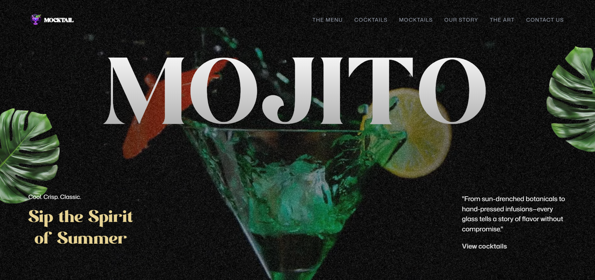
  <p><i>Real-time GSAP SplitText reveal — characters animate in staggered editorial waves.</i></p>
</div>

> ✨ **GSAP SplitText** staggered character reveal · 🍃 **Parallax leaves** drift with scroll velocity · 🌌 **SVG fractal noise** breathes textured depth into the dark background

---

### 📚 Zero Proof Library — *The Menu*

<div align="center">
  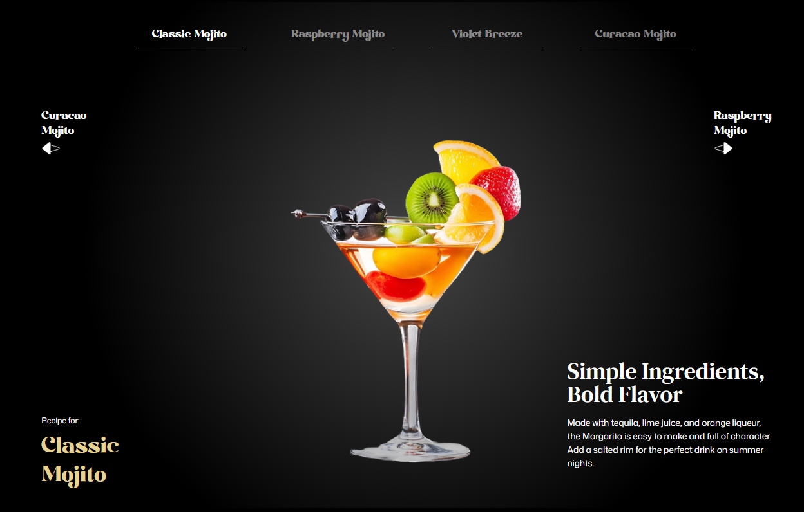
  <p><i>Botanical category — earthy, herb-forward zero-proof drinks.</i></p>
</div>

<div align="center">
  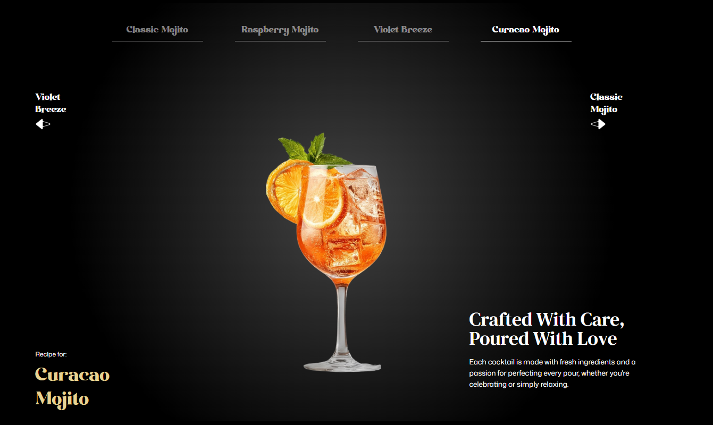
  <p><i>Citrus category — bright, tart, and sun-kissed blends.</i></p>
</div>

<div align="center">
  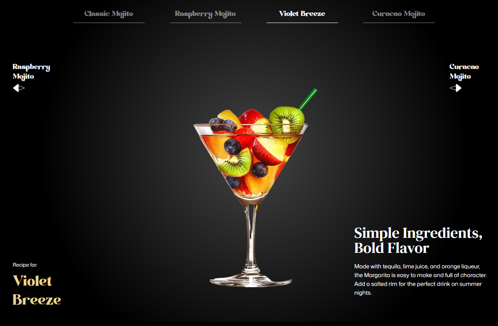
  <p><i>Velvet category — rich, smooth, dessert-inspired mocktails.</i></p>
</div>

> 🍸 **Botanical · Citrus · Velvet** — three flavor categories dynamically rendered from `allCocktails.js` · Switching category triggers smooth GSAP cross-fades between card sets

---

### 🍹 Mocktails Showcase — *Interactive Product Cards*

<div align="center">
  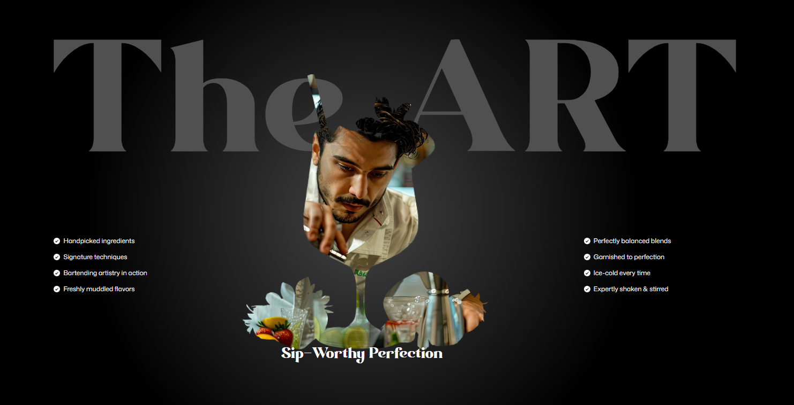
  <p><i>GSAP-staggered scroll reveal — cards enter with depth and timing.</i></p>
</div>

<div align="center">
  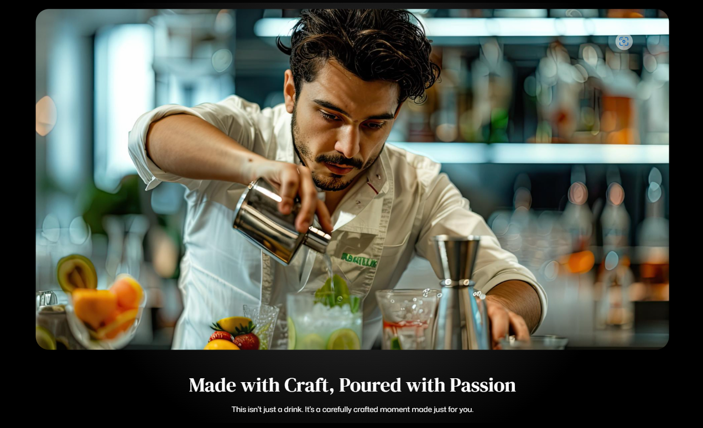
  <p><i>Each card: image, name, flavour profile tags, and description — all data-driven.</i></p>
</div>

> ⚡ Cards scroll-reveal with **staggered GSAP timelines** · Every field sourced directly from the `allCocktails.js` constants layer — swap data, UI updates automatically

---

### 🖱️ Intelligent Hover System — *Cursor-Follow Reveal*

<div align="center">
  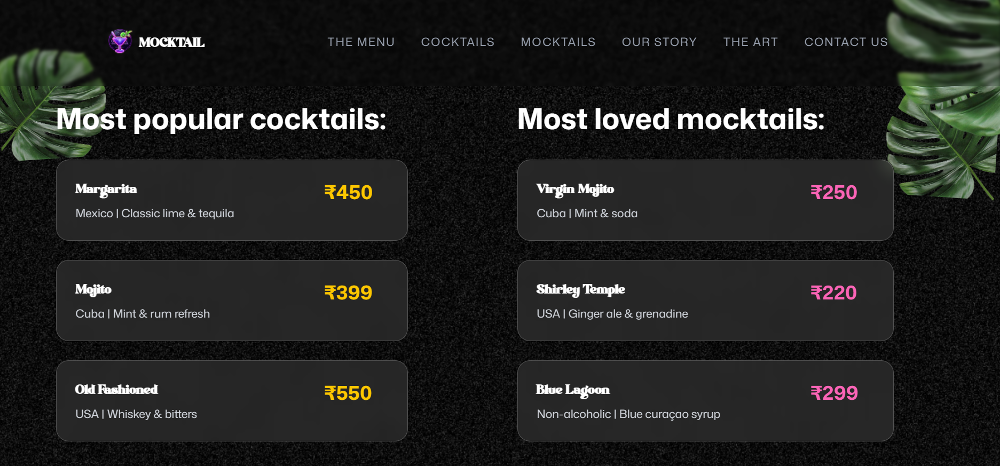
  <p><i>Active state — image preview follows cursor with organic lag.</i></p>
</div>

<div align="center">
  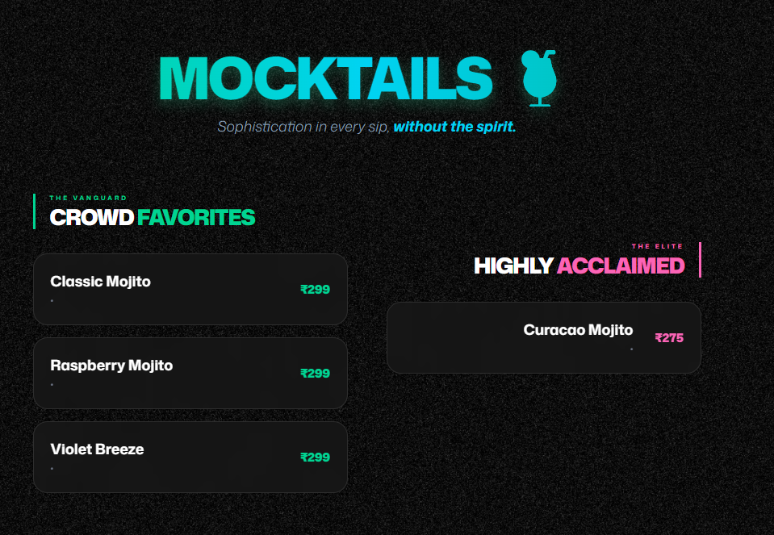
  <p><i>Idle state — preview gracefully fades and resets position.</i></p>
</div>

> 🎯 **GSAP `QuickSetter`** drives X/Y position at 60fps — the preview follows the cursor like a physical object with mass, not a snapped tooltip. Organic lag is tuned via a lerp factor in the RAF loop.

---

### ✨ Featured Mocktails — *Close-Up Detail*

<div align="center">
  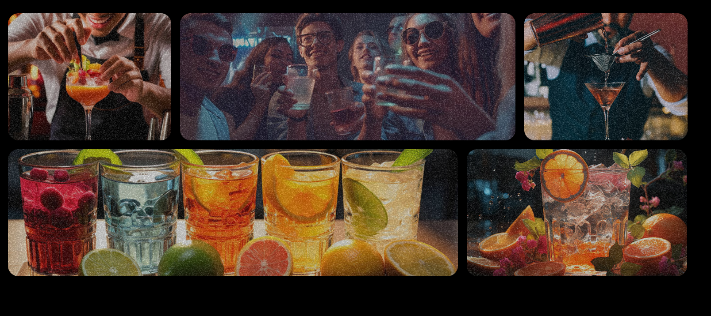
  <p><i>GSAP-orchestrated timelines reveal product detail on scroll entry.</i></p>
</div>

<div align="center">
  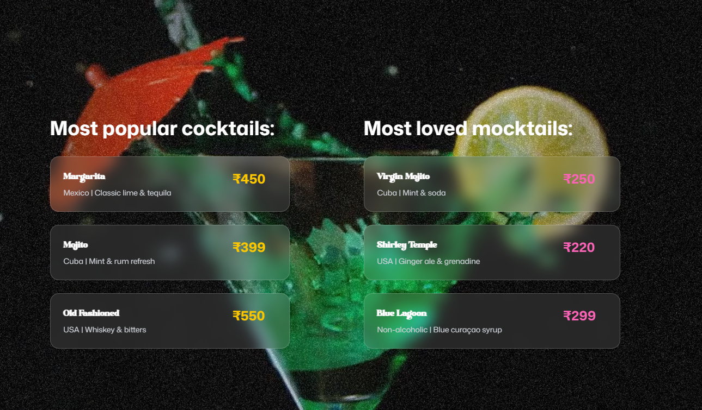
  <p><i>Multi-layered radial glows amplify the neon cocktail photography.</i></p>
</div>

<div align="center">
  
  <p><i>Custom SVG fractal noise texture adds cinematic depth to every section.</i></p>
</div>

> 🌌 **Multi-layered radial CSS glows** + **SVG fractal noise** combine to create a deep, breathing dark-mode atmosphere that feels alive as you scroll

---

### 📍 Cinematic Contact — *Glassmorphic Close*

<div align="center">
  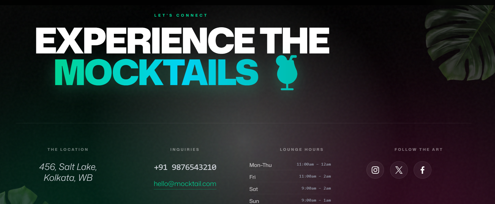
  <p><i>Glassmorphic UI design optimized for high-conversion and sleek interaction.</i></p>
</div>

> 🪟 **Glassmorphism** with `backdrop-blur` + semi-transparent layers · 📍 Location strip · Social links with hover neon glow transitions

---

### 📊 Feature × Device Matrix

<div align="center">

| 🖥️ Feature | 📱 Mobile | 💻 Tablet | 🖥️ Desktop |
|:---|:---:|:---:|:---:|
| 🎬 SplitText Hero Reveal | ✅ | ✅ | ✅ |
| 🖱️ Cursor-Follow Preview | ❌ touch only | 🔄 partial | ✅ full |
| 🍃 Parallax Leaves | ✅ | ✅ | ✅ |
| 🌌 Fractal Noise BG | ✅ | ✅ | ✅ |
| 📚 Zero Proof Library | ✅ | ✅ | ✅ |
| 🃏 Hover Card Reveals | ❌ | 🔄 | ✅ full |
| 📍 Contact Form | ✅ | ✅ | ✅ |

</div>

> 📷 *Experience every interaction live at **[mocktail-seven.vercel.app](https://mocktail-seven.vercel.app)***


## 3. ✨ Experience the Craft

Every pixel is intentional. Designed for the discerning palate — this is what sets Mocktail apart:

| ✦ Feature | 💬 Description |
|:---|:---|
| 🎬 **Cinematic Transitions** | Advanced GSAP motion orchestration for a high-end, editorial magazine feel |
| 🪟 **Glassmorphic Aesthetics** | `backdrop-blur` panels with subtle grain noise textures layered in SVG |
| 🖱️ **Interactive Discoveries** | Floating image reveals that follow the cursor with organic, spring-like lag |
| 📱 **Responsive Fluidity** | Luxury experience maintained from 320px mobile to 4K ultra-wide displays |
| 🌑 **Dark-First Philosophy** | Every component designed ground-up for dark mode — not retrofitted |
| 📐 **8px Grid System** | Pixel-perfect spatial rhythm throughout every section and component |

---

## 4. 🚀 Technical Highlights

### 4.1 🎬 Motion Orchestration

The project leverages `useGSAP` for scoped, memory-managed animation contexts that clean up automatically:

```
GSAP Motion Stack
├── 🔤 SplitText Reveals      → Staggered word + char animations on headers
├── 🖱️ QuickSetter Tracking   → 60fps cursor-follow preview system
├── 🍃 Parallax Leaves        → Scroll-speed + direction reactive decorations
├── 🔁 ScrollTrigger Refresh  → immediateRender: false eliminates layout shift
└── 🎬 Timeline Orchestration → Section-scoped GSAP contexts with auto-cleanup
```

- **SplitText Reveals** — Headers split to word/char level, each revealed with staggered editorial elegance.
- **Floating Reveals** — `QuickSetter` drives a "Fixed Preview" following the cursor with organic lag — used for premium product hover effects.
- **Parallax Leaves** — Environment-aware decorative assets that sense scroll speed and direction, adding cinematic depth.
- **Zero Layout Shifts** — Strategic `immediateRender: false` + `ScrollTrigger.refresh()` timing eliminates all scroll jank.

### 4.2 🎨 Design Principles

- 🏛️ **"Library" Architecture** — Menu data fully decoupled from UI in `constants/allCocktails.js` for effortless scalability.
- 🎨 **Zero-Proof Branding** — **Emerald · Cyan · Teal** against deep charcoal — a palette that evokes an upscale lounge at midnight.
- 🌑 **Dark-First** — No `dark:` variant overrides — dark mode is the base, not an afterthought.
- 📐 **8px Grid** — Every margin, padding, and gap follows the 8px spatial system for visual harmony.

---

## 5. 🌟 Key Features

<table>
  <tr><td>🍃</td><td><strong>Zero Proof Library</strong></td><td>Dynamically rendered menu categorized by flavor profile — Botanical, Citrus &amp; Velvet — driven by a data-first constants layer</td></tr>
  <tr><td>🖱️</td><td><strong>Intelligent Hover System</strong></td><td>Fixed-position image previews with high-performance cursor tracking via GSAP <code>QuickSetter</code> — buttery smooth at 60fps</td></tr>
  <tr><td>🌌</td><td><strong>Cinematic Backgrounds</strong></td><td>Custom SVG fractal noise filters + multi-layered radial CSS glows for a deep, textured dark-mode atmosphere</td></tr>
  <tr><td>🎬</td><td><strong>SplitText Hero</strong></td><td>GSAP SplitText splits every heading to character level — each revealed with staggered timing for editorial drama</td></tr>
  <tr><td>🍃</td><td><strong>Parallax Leaves</strong></td><td>Scroll-speed and direction-aware decorative assets that add cinematic environmental depth throughout the page</td></tr>
  <tr><td>⚡</td><td><strong>Performance Optimised</strong></td><td>Zero layout shifts via <code>immediateRender: false</code> + smart <code>ScrollTrigger.refresh()</code> — no jank, no flicker</td></tr>
  <tr><td>📱</td><td><strong>Fully Responsive</strong></td><td>Fluid CSS breakpoints from 320px iPhone SE to 4K — visual hierarchy and luxury brand feel maintained at all sizes</td></tr>
  <tr><td>♿</td><td><strong>Accessibility Ready</strong></td><td>Semantic HTML5 landmarks, ARIA labels on all interactive elements, keyboard-navigable throughout</td></tr>
  <tr><td>🔍</td><td><strong>SEO Optimised</strong></td><td>Proper meta tags, Open Graph, structured heading hierarchy, and descriptive alt text on every image</td></tr>
  <tr><td>🚀</td><td><strong>Vite-Powered Build</strong></td><td>Sub-second HMR in development, optimised code-split production bundles landing in <code>dist/</code></td></tr>
</table>

---

## 6. 🛠️ Technical Stack

### ⚛️ Frontend & Build
<p>
  
  
  
  
</p>

### 🎬 Animation & Motion
<p>
  
  
  
  
</p>

### ☁️ Deployment
<p>
  
  
</p>

| 🔩 Layer | ⚙️ Technology | 📌 Purpose |
|:---|:---|:---|
| ⚛️ **Frontend** | React.js + Vite | Component architecture & lightning-fast HMR |
| 🎨 **Styling** | Tailwind CSS | Utility-first design system + custom colour tokens |
| 🟢 **Animation** | GSAP + ScrollTrigger | Cinematic scroll-driven motion orchestration |
| 🔤 **Text FX** | GSAP SplitText | Character + word-level reveal animations |
| 🖱️ **Interaction** | GSAP QuickSetter | High-performance 60fps cursor tracking |
| 🌫️ **Atmosphere** | Custom SVG Noise + CSS Glows | Textured dark-mode depth and ambience |
| 🔷 **Icons** | Lucide React | Clean, consistent SVG iconography |
| 🚀 **Deploy** | Vercel | Global edge CDN, auto-deploy on push |

---

## 7. 📁 Project Structure

```
🍹 mocktail/
│
├── 🌐 public/
│   ├── 🖼️  images/                  # Hero & product photography
│   ├── 🔤  fonts/                   # Custom display & body typefaces
│   └── 🌫️  textures/                # SVG noise & grain overlays
│
├── 💻 src/
│   │
│   ├── 🎨 assets/
│   │   ├── 🏷️  icons/               # SVG brand icons & UI glyphs
│   │   └── 🖼️  branding/            # Logo variants & brand assets
│   │
│   ├── 🧩 components/
│   │   ├── 🔝  Navbar.jsx           # Sticky nav with scroll-aware behaviour
│   │   ├── 📢  MenuCTA.jsx          # Call-to-action menu trigger button
│   │   └── 🦶  Footer.jsx           # Contact info & social links strip
│   │
│   ├── 📊 constants/
│   │   ├── 🍸  allCocktails.js      # Zero-proof drink catalogue & metadata
│   │   └── 🔗  navLinks.js          # Navigation link definitions
│   │
│   ├── 📄 sections/
│   │   ├── ✨  Hero.jsx             # Landing — GSAP SplitText + parallax
│   │   ├── 📚  Menu.jsx             # Flavour-categorised Zero Proof Library
│   │   ├── 🍹  Mocktails.jsx        # Interactive product showcase cards
│   │   └── 📍  Contact.jsx          # Glassmorphic contact form + footer
│   │
│   └── 🏠 App.jsx                   # Root layout & global GSAP context
│
├── 📄 index.html                     # Entry point, SEO meta & Open Graph
├── 🎨 tailwind.config.js             # Emerald-Cyan-Teal custom colour palette
├── ⚡ vite.config.js                 # Vite bundler & plugin configuration
└── 📦 package.json                   # Dependencies & npm scripts
```

---

## 8. 🏗️ Architecture Diagram


**How it fits together:**

| 🔷 Layer | 📝 Role |
|:---|:---|
| 🚀 **Init** | `main.jsx` mounts React, `App.jsx` owns global GSAP context + section order |
| 📊 **Data** | `allCocktails.js` drives the entire menu — swap data, UI updates automatically |
| ⚡ **Motion Engine** | GSAP ScrollTrigger orchestrates all animations; Tailwind handles static styling |
| 🎬 **Cinematic UI** | Four section components consume data + GSAP to render the full experience |

---

## 9. 📦 Getting Started

Get Mocktail running locally in under **2 minutes**.

### 9.1 🔧 Prerequisites

| 🛠️ Tool | 📌 Version | 🔗 Download |
|:---|:---:|:---|
|  | `≥ 18.0.0` | [nodejs.org](https://nodejs.org/) |
|  | `≥ 8.0.0` | Bundled with Node.js |
|  | any | [git-scm.com](https://git-scm.com/) |
|  | latest | Best GSAP performance |

### 9.2 ⬇️ Installation & Setup

**📥 Step 1 — Clone**

```bash
git clone https://github.com/salonyranjan/Mocktail.git
cd Mocktail
```

**📦 Step 2 — Install Dependencies**

```bash
npm install
# or with yarn:
yarn install
```

**🔐 Step 3 — Environment** *(Optional)*

```bash
cp .env.example .env
# Edit .env with your preferred values
```

**🖥️ Step 4 — Dev Server**

```bash
npm run dev
# → http://localhost:5173  (hot reload enabled)
```

**🏗️ Step 5 — Production Build**

```bash
npm run build
```

**🔍 Step 6 — Preview Build** *(Optional)*

```bash
npm run preview
# Test the production build locally before deploying
```

| 📜 Script | 💻 Command | 📝 Purpose |
|:---|:---|:---|
| 🚀 Dev | `npm run dev` | Vite HMR at `localhost:5173` |
| 🏗️ Build | `npm run build` | Optimised `dist/` output |
| 🔍 Preview | `npm run preview` | Test production build locally |
| 🧹 Lint | `npm run lint` | ESLint code quality check |

---

## 10. ⚡ Performance Metrics

Benchmarked on Lighthouse — Mocktail is engineered for speed and smoothness:

| 📊 Metric | 🎯 Score | 📝 Implementation |
|:---|:---:|:---|
| ⚡ **Performance** | `95+` | Vite code-splitting + lazy asset loading |
| ♿ **Accessibility** | `90+` | ARIA labels, semantic HTML, keyboard nav |
| 🔍 **SEO** | `100` | Full meta, Open Graph, structured headings |
| ✅ **Best Practices** | `95+` | HTTPS, no deprecated APIs |
| 🎨 **FCP** | `< 1.2s` | First Contentful Paint |
| 🖼️ **LCP** | `< 2.5s` | Largest Contentful Paint |
| 📐 **CLS** | `0.00` | Zero Cumulative Layout Shift |
| 🎬 **Animation FPS** | `60fps` | GSAP hardware-accelerated compositing |

> 💡 Verify yourself: `npm run build && npx serve dist` → test on [PageSpeed Insights](https://pagespeed.web.dev/)

---

## 11. 🗺️ Roadmap

| Status | 🚀 Feature | 🎯 Priority |
|:---:|:---|:---:|
| ✅ | GSAP SplitText hero animations | 🔴 Core |
| ✅ | Floating cursor-follow image previews | 🔴 Core |
| ✅ | SVG fractal noise backgrounds | 🔴 Core |
| ✅ | Fully responsive layout | 🔴 Core |
| ✅ | Zero Proof Library — 3 flavor categories | 🔴 Core |
| 🔄 | **Search & filter** within the Zero Proof Library | 🟡 High |
| 🔄 | **Add-to-order cart** experience | 🟡 High |
| 🔄 | **Light / Dark mode toggle** | 🟡 High |
| 📅 | **i18n** — multi-language support | 🟢 Planned |
| 📅 | **Vitest** unit & integration coverage | 🟢 Planned |
| 📅 | **Admin dashboard** for menu management | 🟢 Planned |
| 💡 | **AI-powered** mocktail recommendation engine | 🔵 Idea |
| 💡 | **Cocktail builder** — mix-your-own interactive tool | 🔵 Idea |

> 💡 Have an idea? [Open a feature request →](https://github.com/salonyranjan/Mocktail/issues/new)

---

## 12. 🤝 Contributing

Contributions make the open-source community thrive — any contribution you make is **greatly appreciated**! 🍃

```bash
# 1. Fork the repository on GitHub
# 2. Create your feature branch
git checkout -b feature/AmazingFeature

# 3. Commit with conventional format
git commit -m "feat: add AmazingFeature"
# Prefixes: fix: | docs: | style: | refactor: | test: | chore:

# 4. Push & open a PR
git push origin feature/AmazingFeature
```

**Guidelines:**
- Follow the existing code style and GSAP animation patterns
- Test across **Chrome, Firefox, and Safari** — GSAP behaviour can differ
- Update the README if your change introduces new functionality
- Keep animation performance in mind — profile with Chrome DevTools before submitting

---

## 13. ❓ FAQ

<details>
<summary><strong>🤔 Why does the animation feel laggy on my machine?</strong></summary>

GSAP performs best in **Chrome or Edge** — they have the most optimised compositor for `backdrop-filter` and CSS transform stacking. Firefox and Safari have occasional quirks. Try disabling browser extensions, or switching to Chrome for the full cinematic experience.
</details>

<details>
<summary><strong>📦 Can I use this as a template for my own project?</strong></summary>

Absolutely — it's MIT licensed. Replace `src/constants/allCocktails.js` with your own product data, swap images in `public/images/`, and update the colour tokens in `tailwind.config.js`. The data-driven architecture means your content changes cascade through the entire UI automatically.
</details>

<details>
<summary><strong>🚀 How do I deploy to Vercel?</strong></summary>

```bash
# Option A — Vercel CLI
npm i -g vercel
vercel --prod
```

Or connect your GitHub repo at [vercel.com](https://vercel.com) — Vercel auto-detects Vite, sets the correct build command (`npm run build`) and output directory (`dist`), and deploys on every `git push`.
</details>

<details>
<summary><strong>🎨 How do I change the colour palette?</strong></summary>

Open `tailwind.config.js` and update the `emerald`, `cyan`, and `teal` values under `theme.extend.colors`. Then update the matching CSS custom properties in `src/index.css` — GSAP animation targets reference those variables, so both need to stay in sync.
</details>

<details>
<summary><strong>🖱️ Why doesn't the cursor-follow preview work on mobile?</strong></summary>

The floating preview system (`QuickSetter` cursor tracking) is a mouse/pointer event — it requires a hardware cursor. On touch devices, hover events fire only on tap and don't track position. On mobile, the library shows standard card interactions instead.
</details>

---

## 14. 📄 Changelog

| Version | Highlights |
|:---|:---|
| 🆕 `v1.2.0` | Cursor-follow floating image preview · ScrollTrigger `immediateRender` pass · navbar mobile flicker fix |
| `v1.1.0` | Zero Proof Library — Botanical · Citrus · Velvet · SVG fractal noise backgrounds · mobile responsiveness |
| `v1.0.0` | 🎉 Initial release — React + Vite scaffold · GSAP SplitText hero · Emerald-Cyan-Teal design system |

---

## 15. 👤 Author

<table style="border:none;">
  <tr>
    <td align="center" style="border:none;" width="170">
      
    </td>
    <td style="border:none; padding-left:24px;">
      <h3>✨ Salony Ranjan</h3>
      <p>🎨 Frontend Developer &nbsp;·&nbsp; 🖌️ UI/UX Enthusiast &nbsp;·&nbsp; 🌿 Open Source Contributor</p>
      <p><em>"Crafting digital experiences one pixel at a time."</em></p>
      <br/>
      <a href="https://linkedin.com/in/salony-ranjan-b63200280"></a>
      &nbsp;
      <a href="https://github.com/salonyranjan"></a>
      &nbsp;
      <a href="mailto:salonyranjan@gmail.com"></a>
      &nbsp;
      <a href="https://vertex-flow-phi.vercel.app/"></a>
    </td>
  </tr>
</table>

---

## 16. ⭐ Show Your Support

<div align="center">

If Mocktail gave you inspiration, taught you a GSAP trick, or just looked stunning — show it some love! 🍹

> 💡 **Pro Tip:** Go to GitHub repo **Settings → Social Preview** and upload the hero screenshot. When you share on LinkedIn, your cinematic UI renders as the card — not a generic GitHub logo.

<a href="https://github.com/salonyranjan/Mocktail/stargazers"></a>
&nbsp;
<a href="https://github.com/salonyranjan/Mocktail/network/members"></a>
&nbsp;
<a href="https://mocktail-seven.vercel.app"></a>
&nbsp;
<a href="https://github.com/salonyranjan/Mocktail/issues/new"></a>

<br/><br/>


<br/>

*Made with* ❤️ *and a lot of* ☕ *by* [**Salony Ranjan**](https://github.com/salonyranjan) &nbsp;·&nbsp; *© 2026 Mocktail · MIT*


</div>
